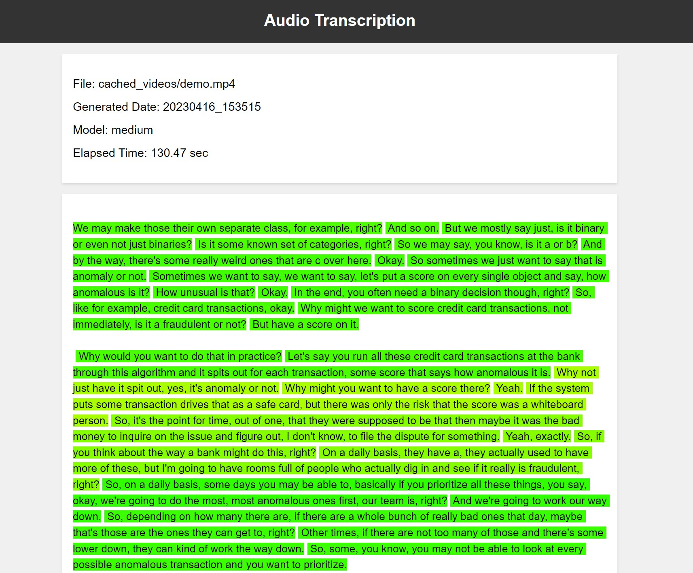

# Whisper-Pipe
A [whisper](https://github.com/openai/whisper)-based, lightweight transcription pipeline for processing audio and/or video files in batch mode, generating accurate transcriptions with **color-coded confidence scores** to indicate the reliability of each transcribed segment. For the demo of whisper's capability, visit [replicate.com/openai/whisper](https://replicate.com/openai/whisper).

To start up, install the dependencies from the file `requirements.txt`. You can run `python pipe.py` to start the pipeline after you modify your folder name and model preference in `pipe.py`.

## Future Plan
- [ ] Support configuring input, output, and model preference through argument parsing
- [ ] Add a test program for demonstration
- [ ] Support smarter paragraph splitting (By default, we combine `15` adjacent sentence blocks into a paragraph currently.)
