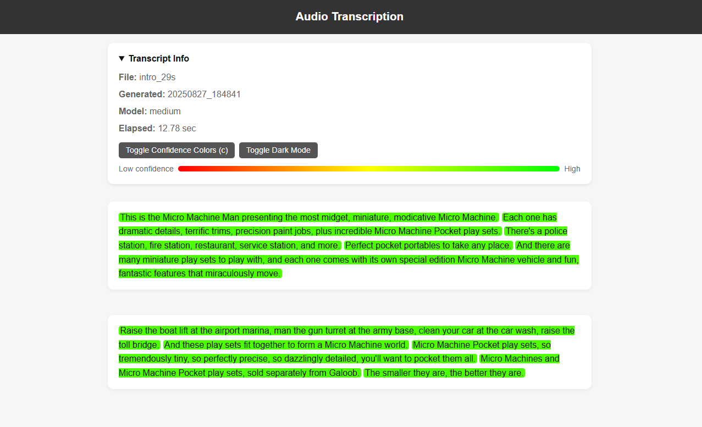

# Careful Whisper

> No careless whispers, only words colored with confidence.

A [whisper](https://github.com/openai/whisper)-based, lightweight transcription pipeline for processing audio and/or video files in batch mode, generating accurate transcriptions with **color-coded confidence scores** to indicate the reliability of each transcribed segment. For the demo of whisper's capability, visit [replicate.com/openai/whisper](https://replicate.com/openai/whisper).



## Environment Setup
1. Install the python dependencies listed in `requirements.txt`:
```bash
pip install -r requirements.txt
```
2. Make sure required system-level dependencies are installed. If not, you may need to install **ffmpeg** (e.g., on Debian/Ubuntu-based distributions) via:
```bash
sudo apt-get update
sudo apt-get install ffmpeg
```

## Supported Arguments
```bash
$ python pipe.py -h
usage: pipe.py [-h] [--output-html-dir OUTPUT_HTML_DIR] [--output-json-dir OUTPUT_JSON_DIR] [--no-json]
    [--logs-dir LOGS_DIR] [--recursive] [--overwrite | --no-overwrite] [--no-timestamp-to-name] 
    [--model {tiny,base,small,medium,large,turbo}] [--language LANGUAGE] [--word-timestamps]
    [--audio-format AUDIO_FORMAT] [--keep-intermediate-audio] [--log-level {DEBUG,INFO,WARNING,ERROR,CRITICAL}] 
    [--log-file LOG_FILE] path

Whisper-based transcription pipeline (single file or batch directory).

options:
  -h, --help            show this help message and exit

I/O:
  path                  Path to a media file (single run) OR a directory (batch run).
  --output-html-dir OUTPUT_HTML_DIR
                        Directory to write highlighted HTML outputs. (default: artifacts/html)
  --output-json-dir OUTPUT_JSON_DIR
                        Directory to dump raw Whisper JSON (use --no-json to disable). (default: artifacts/json)
  --no-json             Disable writing raw JSON transcription outputs. (default: False)
  --logs-dir LOGS_DIR   Directory for pipeline logs. (default: artifacts/logs)

Run mode:
  --recursive           When PATH is a directory, search recursively for media files. (default: False)
  --overwrite, --no-overwrite
                        Allow overwriting existing HTML outputs. (default: True)
  --no-timestamp-to-name
                        Disable appending (YYMMDD_HHMM) to output filename stem. (default: False)

Model & transcription:
  --model {tiny,base,small,medium,large,turbo}
                        Which Whisper model to use. (default: base)
  --language LANGUAGE   Force a language (name like 'English' or code like 'en'). Default: auto. (default: None)
  --word-timestamps     Enable word-level timestamps (experimental). (default: False)

Media conversion:
  --audio-format AUDIO_FORMAT
                        Temp audio format used when converting video to audio. (default: wav)
  --keep-intermediate-audio
                        Persist the converted temp audio file instead of deleting it. (default: False)

Logging:
  --log-level {DEBUG,INFO,WARNING,ERROR,CRITICAL}
                        Console and file log level. (default: INFO)
  --log-file LOG_FILE   Log filename inside --logs-dir. (default: whisper.log)

Supported models: tiny, base, small, medium, large, turbo.
Supported languages: 
    ==> Default: auto-detect
    ==> You may pass a language *name* (e.g., 'English', 'French') or a code (e.g., 'en', 'fr')
    ==> Known names (e.g., en): see https://github.com/openai/whisper/blob/main/whisper/tokenizer.py for details
```

## Sample usage
For demonstration purposes, you can try the following workflow in a fresh Jupyter notebook on [Google Colab](https://colab.research.google.com/):
```python
# Clone the repository
!git clone https://github.com/williamqwu/careful-whisper.git careful_whisper
%cd careful_whisper

# Verify the working directory
!pwd
!ls

# Install Python dependencies
!pip install -r requirements.txt

# Download a sample audio file
!wget -O test.wav https://cdn.openai.com/whisper/draft-20220913a/younha.wav

# Run the pipeline (note: place options before positional arguments)
!python pipe.py --model tiny test.wav
```

## Future Plan
- [x] Implement smarter paragraph splitting.
- [x] Add configurable input, output, and model preferences via argument parsing.
- [x] Add a demonstration test program.
- [ ] Speaker diarization: differentiate between voices of different individuals.
- [ ] Word-level confidence scoring: provide per-word reliability estimates.
